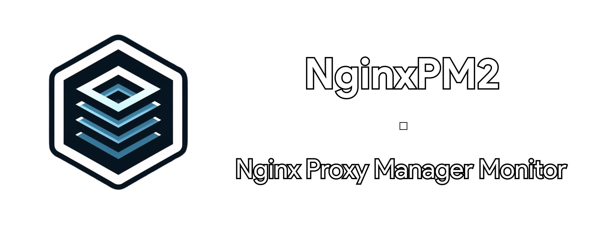

<h1>NginxPM2</h1>

A simple, but yet efficient, way of managing all your Nginx Proxy Manager instances !

<h4>  ·  <a href="https://github.com/Oneloutre/NginxPM2/blob/master/README.md"> Documentation </a>  ·  <a href="https://github.com/Oneloutre/NginxPM2/issues"> Report Bug </a>  ·  <a href="https://github.com/Oneloutre/NginxPM2/issues"> Request Feature </a> </h4>

    

----

# :notebook_with_decorative_cover: Table of Contents

- [About the Project](#star2-about-the-project)
- [License](#warning-license)
- [Contact](#handshake-contact)

## :star2: About the Project

:whale: • Serverside using Docker.

:computer: • Frontend using HTML/CSS (bootstrap for the biggest part).

:snake: • Backend using Python.

## :warning: License

Distributed under the MIT License. See LICENSE.txt for more information.

## :handshake: Contact

 : `onelots.`

 : `onelots@onelots.fr`

-----

 Project Link: [https://github.com/Oneloutre/NGINXPM2](https://github.com/Oneloutre/NGINXPM2)